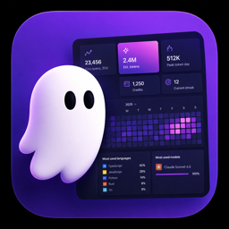

# Kiro Activity Insights

<div align="center">
  
</div>

A Kiro IDE profile panel that shows local activity stats, optional public leaderboard sharing, and a clean share card.


## Features

### Activity Heatmap
- **GitHub-style contribution graph** showing your daily activity
- Tracks git commits and Kiro session usage
- Multi-year view with year selector
- Visual intensity levels based on token usage and commits

### Profile Metrics
- **Kiro launches** in the last 30 days
- **Local session count**
- **Estimated token usage**
- **Plan / quota badge** from local Kiro metadata when available
- **Most used models**

### Kiro Setup
- **Hooks installed**
- **Powers installed**
- **Extensions installed**

### AI Model Analytics
- Most-used AI models ranked by turn count
- Model usage statistics from session history
- Tracks all model interactions automatically

### Public Leaderboard
- Toggle the profile between **Private** and **Public**
- Public mode sends a small snapshot to the hosted leaderboard
- Private mode removes the public leaderboard entry
- Syncs when the token snapshot changes, or at least once every 24 hours while the profile view is active

### Profile Customization
Configure your profile display through VS Code settings:
- **Display Name**: Your full name shown on the profile card
- **Username**: Handle displayed below your name
- **Plan Label**: Badge shown next to username (e.g., "Local", "Pro")
- **Leaderboard URL**: Website endpoint for public profile sync

### Share Card Generator
- Export your profile as a shareable PNG image
- Saved to `kiro-profile-shares/` in your workspace
- Perfect for showcasing your development activity

### Privacy-First Defaults
- Local profile data stays private unless you turn on Public
- Data sourced from local git history and Kiro session files
- Public leaderboard sync sends only a generated public ID, display name, handle/account label, and token total
- Raw Kiro account ARNs are not displayed or sent

## Installation

### Public Download

Download the latest public VSIX:

[kiro-activity-insights-0.2.11.vsix](https://github.com/Jagatees/Kiro-Profile/releases/download/v0.2.11/kiro-activity-insights-0.2.11.vsix)

Then install it in Kiro:

1. Open Command Palette (`Cmd+Shift+P` on macOS, `Ctrl+Shift+P` on Windows/Linux)
2. Run **Extensions: Install from VSIX...**
3. Select the downloaded `.vsix`
4. Open **Kiro Profile** from the activity bar

### From VSIX File

1. Download the latest `.vsix` file from releases or build from source
2. Install in Kiro IDE:
   - Open Command Palette (Ctrl+Shift+P / Cmd+Shift+P)
   - Run "Extensions: Install from VSIX..."
   - Select the downloaded `.vsix` file
3. Open **Kiro Profile** from the activity bar (sidebar icon)

### Build from Source

```powershell
# Install dependencies
npm install

# Compile TypeScript
npm run compile

# Package extension
npm run package
```

This generates a `.vsix` file you can install in Kiro.

## Usage

### Opening the Profile Panel

**Method 1**: Click the **Kiro Profile** icon in the activity bar (left sidebar)

**Method 2**: Use Command Palette
- Press `Ctrl+Shift+P` (Windows/Linux) or `Cmd+Shift+P` (Mac)
- Run "Kiro Profile: Open Activity Insights"

### Refreshing Data

Click the refresh button in the panel header or run "Kiro Profile: Refresh Activity Insights" from the Command Palette.

### Customizing Your Profile

1. Open Settings (File > Preferences > Settings)
2. Search for "Kiro Activity Insights"
3. Configure:
   - `kiroActivityInsights.displayName` - Your display name
   - `kiroActivityInsights.username` - Your username/handle
   - `kiroActivityInsights.planLabel` - Badge label (e.g., "Local", "Pro")
   - `kiroActivityInsights.leaderboardUrl` - Public leaderboard site URL

### Publishing to the Leaderboard

1. Open the Kiro Profile panel
2. Toggle **Private** to **Public**
3. The extension syncs your current profile snapshot to the configured leaderboard
4. Toggle back to **Private** to remove your public entry

### Sharing Your Profile

1. Click the **Share** button in the profile panel
2. Image is saved to `kiro-profile-shares/` in your workspace
3. Share the PNG on social media or with your team

## How It Works

### Data Sources

The extension collects activity data from multiple local sources:

**Git History**
- Parses git log for the last 365 days
- Extracts commit dates to build activity timeline
- Uses `git log --date=short --pretty=format:%ad --all --since="365 days ago"`

**Kiro Session Files**
- Reads session JSON files from `~/.kiro/sessions/`
- Extracts token counts, credits, model usage, and timestamps
- Estimates metrics from session file sizes when exact data unavailable

**Workspace Sessions**
- Scans `%APPDATA%/Kiro/User/globalStorage/` for session data
- Reads workspace session indexes and session detail files

**Token Generation Logs**
- Reads `dev_data/tokens_generated.jsonl` for detailed token metrics
- Uses token rows when date information is available from surrounding sessions

**Kiro Application Logs**
- Scans log directories in `%APPDATA%/Kiro/logs/` (Windows)
- Counts Kiro launches in the last 30 days
- No sensitive log content is parsed; launch counts come from timestamped directory names

**Kiro Local Account**
- Reads `User/globalStorage/kiro.kiroagent/profile.json`
- Uses the safe account label, such as `BuilderId`
- Uses ARN presence only as signed-in evidence
- Does not show or submit raw ARN values

**Kiro Configuration**
- Counts installed hooks from `~/.kiro/hooks/`
- Counts installed powers from `~/.kiro/powers/`
- Counts extensions from `~/.kiro/extensions/`

### Activity Heatmap Algorithm

1. **Token Estimation**: Session files use explicit token fields when available, then conservative local estimates when needed.
2. **Git Fallback**: Git commit days can appear in the activity timeline when no Kiro tokens exist for that day.
3. **Intensity Levels**: Days are colored relative to the highest activity day in the selected year.

### Streak Calculation

- **Current Streak**: Consecutive days with activity ending today
- **Longest Streak**: Maximum consecutive active days in history
- Minimum streak displayed is 3 days for new users

## Development

### Project Structure

```
kiro-activity-insights/
├── src/
│   └── extension.ts       # Main extension logic
├── resources/
│   └── activity.svg        # Activity bar icon
├── out/                    # Compiled JavaScript output
├── package.json            # Extension manifest
└── tsconfig.json           # TypeScript configuration
```

### Key Components

**ProfileViewProvider**
- Implements `WebviewViewProvider` interface
- Manages webview lifecycle and message handling
- Handles refresh and share card operations

**collectProfileData()**
- Main data aggregation function
- Combines git, session, workspace, and config data
- Computes comprehensive statistics including success rates, activity patterns, and tool usage
- Returns structured `ProfileData` object

**getKiroUsage()**
- Parses Kiro session files and logs
- Extracts token usage (prompt, generated, total), model counts, credits
- Calculates session metrics, durations, and success rates
- Tracks tool usage frequency and sub-agent invocations
- Analyzes hourly activity patterns and streaks

**getWorkspaceFileStats()**
- Walks workspace directory tree (max depth 8)
- Counts files by programming language
- Skips common ignore directories

### Available Scripts

```json
{
  "compile": "tsc -p ./",           // Compile TypeScript to JavaScript
  "watch": "tsc -watch -p ./",       // Compile with watch mode
  "check": "tsc --noEmit -p ./",     // Type-check without output
  "package": "vsce package --allow-missing-repository"  // Create .vsix
}
```

### Contributing

Contributions are welcome! Areas for improvement:

- **Additional metrics**: Enhanced workspace analytics, git diff analysis
- **UI enhancements**: Customizable charts, interactive filtering, date range selection
- **Performance**: Optimize large workspace and session file parsing
- **Export formats**: JSON, CSV, or PDF report generation
- **Themes**: Light mode support and color customization
- **Cross-platform**: Improve macOS and Linux path handling

## Requirements

- Kiro IDE (VS Code compatible version ^1.92.0)
- Node.js and npm (for building from source)
- Git (optional, for commit activity tracking)

## Known Limitations

- **Session file format dependency**: Relies on current Kiro session JSON structure
- **Local history dependency**: Past years only appear when Kiro still has those local session files
- **Platform-specific paths**: Reads Kiro app-data paths on macOS, Windows, and Linux
- **Token estimation**: Without explicit token data, estimates may vary from actual usage

## Privacy & Security

- **Private by default**: No leaderboard sync happens unless you turn on Public
- **Local data only**: Reads only from local git, Kiro config, and session files
- **No tracking or telemetry**: Zero analytics or external reporting
- **Minimal public payload**: Public sync sends a generated public ID, display name, handle/account label, and token total
- **Transparent operation**: All data sources documented and auditable

## Troubleshooting

**Activity heatmap is empty**
- Verify git repository exists with commit history
- Check that Kiro session files exist locally
- Try clicking the refresh button

**Leaderboard does not update**
- Confirm the profile toggle is set to Public
- Check `kiroActivityInsights.leaderboardUrl`
- Click refresh to force the profile view to collect the latest local data

**Share card not saving**
- Check workspace folder is open (default save location)
- Ensure write permissions for workspace directory
- Look for saved images in `kiro-profile-shares/` folder

**Extension not activating**
- Confirm extension is installed and enabled
- Check Kiro compatibility version (^1.92.0)
- Reload window (Command Palette > "Developer: Reload Window")

## License

MIT License - see [LICENSE](LICENSE) file for details

## Changelog

### 0.2.11
- Current stable release
- Added optional public leaderboard sync
- Added local Kiro account label and plan/quota fallback
- Added compact profile UI with heat map, model usage, hooks, powers, and extensions
- Added website Open Graph preview image

### 0.2.7
- Enhanced data collection and metrics calculation
- Improved performance and stability

### 0.2.0
- **Major update**: Complete stats implementation
- Added Session Statistics (turns, success rate, durations)
- Added Token Breakdown (prompt/generated analysis)
- Added Activity Patterns (hourly activity, streaks)
- Added Top Tools tracking (most used functions)
- Added System Stats (errors, warnings, hooks, powers, extensions)
- Improved UI with new organized grid sections
- Enhanced data collection from multiple sources

### 0.1.11
- Previous stable release

### 0.1.4
- Bug fixes and stability improvements

### 0.1.3
- Enhanced metrics calculation

### 0.1.2
- UI refinements

### 0.1.1
- Initial feature set

### 0.1.0
- Initial release with core features

## Author

Published by **jagatees**

## Links

- [Report Issues](https://github.com/jagatees/kiro-profile/issues)
- [Source Code](https://github.com/jagatees/kiro-profile)

---

**Made with ❤️ for the Kiro IDE community**
