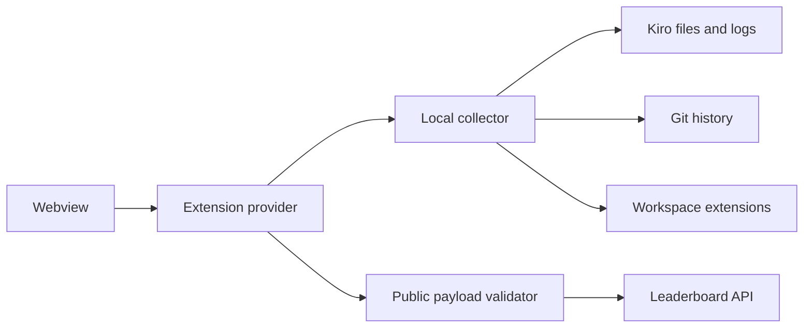

# Architecture

Activation registers the activity-bar webview and commands without scanning. Opening or refreshing the view starts collection. Filesystem walks are bounded by depth, file count, individual size, and total bytes. The provider discards results from stale refreshes.

The webview receives aggregate `ProfileData`; source-derived strings are HTML escaped and inline scripts/styles use a per-render cryptographic nonce. The leaderboard boundary accepts only the documented aggregate contract and rejects suspicious text or insecure remote URLs.
